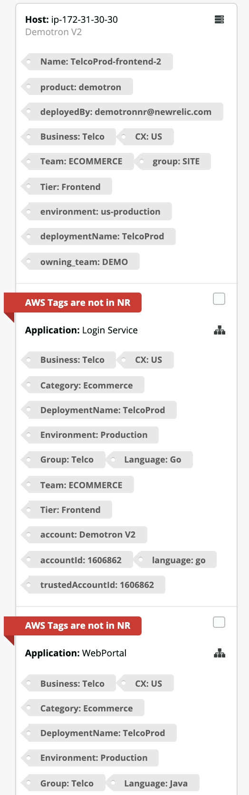

[](https://github.com/newrelic/open-source-office/blob/master/examples/categories/index.md#new-relic-experimental)

# AWS Tags Syncer

An application to import AWS EC2 tags to New Relic APM services.

Add labels to apps in New Relic is a [best practice](https://docs.newrelic.com/docs/apm/new-relic-apm/guides/new-relic-apm-best-practices-guide#labels): when you’ve got several different applications using the same account and each application spans multiple environments (e.g., development, test, pre-production, production), it can be hard to find a specific application in your overview dashboard without tags. APM tags are particularly useful as well if you are using the dynamic targeting feature in alerts or workloads NR1 application.

This application will help NR users to import EC2 AWS tags to the NR APM services running in these instances. 

## Usage
Select an account from the dropdown list:


AWS tags syncer application has three main sections:

* **Filters:** useful to narrow down the scope to a specific NR account, Region, AZ or subnet. You can use also toggles filters to display only entities in sync or not in sync. Each filter accepts multi values and values are searchable by directly typing in the field.


* **Summary:** a summary to show how many EC2 instances are running with APM services, how many APM services are there, how many are in sync etc ...


* **Details:** a list of cards. Each card has the host (name, account and tags), and below, the applications running in the host (name and tags). The server icon is clickable and can open the host entity overview, the application icon is clickable and can open the service overview page. You may have one or multiple apps running in an EC2 instance (there are 2 in the example below).



In Addition to the main sections, there are few other options:

* **Actions:** a list of actions are available: Select all apps, Deselect all apps,  Sync application tags (selected ones) and show help. You can either select all apps (after filtering if needed) or you can manually select each app by clicking in the little box in the application section in each card. Then you can click on "sync you applications tags" to import AWS tags to your APM services.


* **Help:** details the rules this application is using to sync the tags.


## Open source license

This project is distributed under the [Apache 2 license](LICENSE).

## Getting started

1. Ensure that you have [Git](https://git-scm.com/book/en/v2/Getting-Started-Installing-Git) and [NPM](https://www.npmjs.com/get-npm) installed. If you're unsure whether you have one or both of them installed, run the following commands. (If you have them installed, these commands return a version number; if not, the commands won't be recognized.)
```bash
git --version
npm -v
```
2. Install the [NR1 CLI](https://one.newrelic.com/launcher/developer-center.launcher) by going to [this link](https://one.newrelic.com/launcher/developer-center.launcher) and following the instructions (5 minutes or less) to install and set up your New Relic development environment.
3. Execute the following commands to clone this repository and run the code locally against your New Relic data:

```bash
nr1 nerdpack:clone -r https://github.com/newrelic-experimental/nr1-aws-tags-syncer.git
cd nr1-aws-tags-syncer
npm install
nr1 nerdpack:uuid -gf
nr1 nerdpack:serve
```

Visit [https://one.newrelic.com/?nerdpacks=local](https://one.newrelic.com/?nerdpacks=local), navigate to the Nerdpack, and :sparkles:

When installed you should see this launcher in NR1 welcome page:


## Deploying this Nerdpack

Open a command prompt in the nerdpack's directory and run the following commands:

```bash
# If you need to create a new uuid for the account to which you're deploying this Nerdpack, use the following
# nr1 nerdpack:uuid -g [--profile=your_profile_name]
# to see a list of APIkeys / profiles available in your development environment, run nr1 credentials:list
nr1 nerdpack:publish [--profile=your_profile_name]
nr1 nerdpack:deploy [-c [DEV|BETA|STABLE]] [--profile=your_profile_name]
nr1 nerdpack:subscribe [-c [DEV|BETA|STABLE]] [--profile=your_profile_name]
```

Visit [https://one.newrelic.com](https://one.newrelic.com), navigate to the Nerdpack, and :sparkles:
